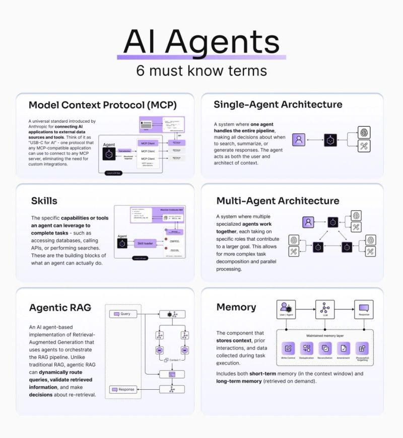

# Udemy - Intro to AI Agents and Agentic AI
* AI Agents are autonomous in decision making process
* Google Gemini 2.0 - Multimodal AI model designed for `Agentic era`
* Nvidia - Nemo - they call it `AI Team mates`
* Salesforce - Agent force

## AI Agents must know terms

## Some AI Agents examples
* Self driving car AI Agent
* Shopping Assistant AI Agent

## Key components to build AI agents:
* Environment - where the agent operates
* Sensors - to perceive the environment
* Model - to process information and make decisions
* Decision making logic - how agent select appropriate action
* Actuators - allows agents to interact with environment. To execute actions in the environment
* Feedback machinism/loop- Allow agents to evaluate whether it has successfully achieved its goals and make adjustments accordingly. To learn and improve over time

## Environment - where the agent operates
* AI Agents responds considering digital data, web data to respond based on environments it is working like self driving cars, shopping cart etc

## Sensors - to perceive the environment
* By which agents receives input from their environment
* Allow gathering information like scraping web (apis, intepreting images from cameras, capturing audio through microphones, analyzing data from IoTs). So allowing agents to sense environments and take appropriate actions

## Model - to process information and make decisions
* Like human brain. After collecting data using `sensors`, it fed to `Model` which acts as tool to interpret incoming perceptions.
* Means knowing and understanding information

## Decision making logic - how agent select appropriate action
* Takes input apply structured rules or algorithms to come with recommendation or actions
* Understand and reason internally. Generate and selection appropriate actions
* Sometime need thin decision making layer to confirm like financial transaction need transaction limits and user authentication before approving
* In some cases we can use prompt engineering and assist LLMs

## Actuators - to execute actions in the environment
* Some cases physical actuators like `Robot arm`, `Steering system` of self driving car
* Virtual actuators - APIs to execute

---
# Key characteristics of AI Agents
* Profile & Persona
* Memory
* Reasoning
* Actions
* Learning capabilities

## Profile & Persona
* Define agent leading role and function
* Area of specialization
* Communication style
* Output formatting
* Tone of voice
* Guidelines it should follow
* Unique charecteristics or traits
* How agent should interacts with users
* Values/guidelines the agent should follow
* Unique characteristics or traits

## Reasoning
* Use available information to draw conclusions and solve problems

## Actions
* Steps agent takes to achieve its goals. Like social media post

## Learning capabilities
* Monitor social media post done as part `Actions` and improve next performance task

---
# Simple Reflex Agent
* Fundamental tool reacts based on immediate perception
* No internal memory
* Ex: Thermostat - read environment give temporature. Do not connect to models
* This is not an `AI Agent`. Just `Agent`

---
# Model based reflex agent
* Perceive environment
* Use memory to maintain `internal representation` of environment
* Construct model around them
* Ex: RoboMop - Builds map of premises and obstacles. Then determine which area alreay cleaned
* Simple form of AI
* Doesn't learn or adapt
* Internal model is static or updated through fixed rules
* Follows static rules. Doesn't improve based on experience

---
# Goal based agent
* Search for action sequences to achieve goal and plan actions
* Like Google map shows the route. If we miss anyline it recalculates immediately for next best route
* Sometimes overlook some details, because always focusing on optimizing goal completion

---
# Utility based agent
* Consider multiple factors to evaluate utility

---
# Learning agent
* Similar to utility based agent
* New experiences are added each time. This enhances its ability to operate in unfamiliar environments and improve performance
* Enhances the model over time based on feedback

---
# Learning from humans
* AI Agents require goals and pre defined rules created by humans
* HITL - Human in the Loop - continuous involvement of humans in the training, monitoring, refinining an AI system

## Customer support chatbot
* Select and curate the training data
* Design chatbot's algorithms and architecture
* Set ethical guidelines and constraints
* Define chatbot's specific objectives

## Learning from external systems
* Learning from other agents
* Connecting to external sources like internet, external databases, apis, web searches
* Human feedback
* Collabarative agent-to-agent learning can speed up response times

---
# AI Agent architecture patterns
* LLMs vs AI Workflows vs AI Agents
* Frameworks to build AI Agents - ReAct(Reason and Act), ReWoo(Reasoning Without Observation)
* LLMs and AI Workflows - Need human inputs to perform actions

## AI Agents
* Proactive and flexibility limitations. Don't need HITL to start working
* Figure out best course of action without humans

---
# Single Agent System
* One agent in system

---
# Multi agent system
* Multiple agents in system. Each agent performing one specialized task
* To use multiple agents effectively we need to orchestrate their tasks inside the overall project workflow
* Agents use tool-calling in the backend to obtain up-to-date information, optimize workflows, create sub-tasks autonomously to achieve complex goals

## Ways to orgnize work of multiple agents
* Manager structure
* Decentralized structure

# Guardrails
* Why are the needed? - To provide necessary protection to mitigate risk while agent taking actions

## How guardrails protect us in the context of AI Agents?
* Information security guradrails - Provide guardrails to identify personal information and hide them
* Brand alignment guardrails - Agent should reflect company tone and culture. Misalignment may cause damage to company brand
* Accuracy guardrails - Prevent agents from hallucinating and providing incorrect answers. Agent responding as `I don't know` is better than false answer/info

### Key points in designing guardrails
* Prioritize data privacy and content safety
* Add new guardrails based on real world edge cases and failures
* Balance security with user experience. Continuously refine guardrails as agent evolves

---
# Human intervention
* Human intution and common sense help identify agent failures, edge cases, improvements and fix them
* Human intervention acts as very good feedback 
* For example - Customer service agent escalates issue to human if it does not know the answer

---
# How to evaluate agents
* What makes AI Agent effective? - Depends on use cases. Some need speed, polite and high in ethics, some need reasoning etc
* Good agents must meet certain criterias:
	* Accuracy
	* Speed
	* Coherence - means logical consistency and clear flow
	* Cost
	* Safety
	* UX - User Experience

# n8n
* Used for build agent workflow, ai agents

# Node types
## 4 node types
* Triggers
* Action nodes
* Logic nodes
* AI Agent nodes

## Workflow
* Every workflow starts with `Triggers` which defines how automation begins

## POC - build email agent
* Build Agent to read information from user
* Draft professional email
* Check name, designation, email address from google sheet
* Send email to that email address

# Infrastructure for AI Agents
* APIs - Connect out AI Agent to External LLMs like (OpenAI, Anthropic, Google) using APIs. Send prompts and receive response
* Cloud services - Deploy AI agents/solutions in cloud services like AWS, Azure, Google Cloud. They are offering robust solutions tailored explicitely for AI workloads. They provide powerful GPUs, extensive storage, Integrated APIs, AI Agent tools to stream development and deployment of AI Agents
* Data and knowledge integration - AI Agents perform best when they are given access to data like `Databases, Enterprise systems, Knowledge bases, Internet` etc

---
## Development frameworks
* LangChain & LangGraph
* Microsoft AutoGen
* CrewAI
* Google ADK (Agents Development Kit)
* Flowise

## LangChain
* Provides 2 essential building blocks - `Chains`, `Agents`
* Chains - used to create agentic workflows. Agentic workflow has `pre-defined steps`
* AI Agents - can adjust actions based on new information
* LangChain has tools that help us easily build agents

## LangGraph
* Add on created by `LangChain`
* Required when single linear chain is not enough
* LangGraph allows draw workflow as explicit directed graph (Graph of Nodes)

## LangChain and LangGraph
* Beginner friendly. Ideal for flexibile learning foundation
* Can work for basic and advanced applications. Like simple FAQ bot to graph of collaborating sub-agents

## Microsoft AutoGen
* Focus on multi agent conversations
* Not as user friendly as `LangChain` tools
* Assign specific roles like `Researcher`, `Coder`, `Reviewer`
* Framework manages structure dailogue where agents `exchange message`, `share memory`, `vote on decisions`
* Because it is Microsoft maintained, it integrates easily with `Azure`, `OpenAI`
* Ideal for `agenet specialization and collaboration`

## CrewAI
* Organizes group of agents
* Operated more streamlined API
* No-code studio interface designed for business users
* Agents coordinate with built-in task-delegation logic
* It internally uses `LangChain` without taking all its complexity

## Google ADK (Agents Development Kit)
* Package google's complex, collaborative agent systems
* allows direct integration to `VertexAI`, `Gemini` models
* More enterprise connectors like `Big Query`, `SAP`

## Flowise
* Perfect tool for beginners
* Democratize the ability to build agents
* Simplifies much of langchain javascript
* Supports branching logic
* HITL check points
* Observability
* Deploy completed flow as `Rest End Point` or `Chat widget`

---
# Deployment of AI Agents
* Ai agents deployment tools from AWS
	* AWS Lambda
	* Bedrock
	* SageMaker
	* Lex