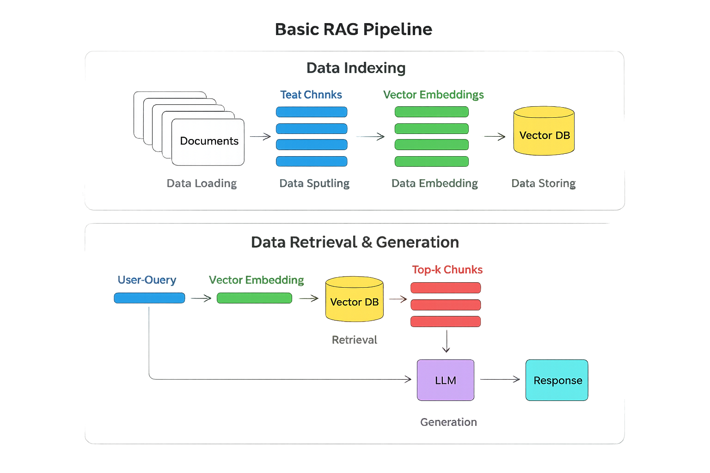

# Udemy - LangChain- Agentic AI Engineering with LangChain & LangGraph
* Develop LLM powered agents with langchain & LangGraph

## LLM Applications types
* Agents
* Retrieval Augmentation Generation (RAG)

# What is LangChain?
* Open source framework that simplifies the process of building LLM powered applications. Like  to Spring in Java
* Provides tools and abstraction that make it easier to create complex LLM powered applications
* Widely adopted. Specially by developers who can build LLM applications without understanding how machine leaning works, how to train models. But use models as black box
* Gives library to connect with LLM and switch between LLMs with simple configuration without changing business logic

## LangChain Prompts
* Help prompts management, optimization, serialization
* Create prompt template. Inject values to prompt at run time. Like `String.format`

## Document loaders
* Helps us to load different data sources like Notion, pdf files, notepads, email etc

---
# What is an agent?
* Software system that use LLM as reasing engint to decide what actions to take and execute those actions
* In chain - sequence of steps are hard coded. In agents - Dynamically determine which tools or steps need to be taken to solve specific task. LLM in agent decides what to do next

---
# RAG Embeddings Vector Databases and Retrieval
* RAG - Retrieval Augmentation Generation
* Prompt + Augment relevant context data - then LLM is able to answer

## If we have large documents 
### Solution 1
* Send entire document text to LLM as prompt then following problems happen
* Hard Token Limit
* Needle in the Heystack
* Cost
* Latency

### Solution 2
* Split original document into smaller chunks (This chunking process is naive and complex)
* Instead of sending entire book, send only specific paragraph or some more
* Drawback
	* Preproecssing to chunk large document. How do we chunk?
	* How to identify relevant chunk for data?
	
## Introduction to Vector Databases
* Embeddings
* Vector stores (Pinecone)
* RetrievalQA Chain
* LangChain document loaders
* LangChain text splitters

## Basic RAG Pipeline

### 🔹 Data Indexing
1. **Documents** → raw input files (PDFs, text, etc.)  
2. **Data Loading** → bring documents into the system  
3. **Data Splitting** → break into smaller **text chunks**  
4. **Data Embedding** → convert chunks into **vector embeddings**  
5. **Data Storing** → save embeddings in a **Vector Database (Vector DB)**  

### 🔹 Data Retrieval & Generation
1. **User Query** → input question  
2. **Vector Embedding** → convert query into embedding  
3. **Vector DB** → search for similar embeddings  
4. **Top-K Chunks** → retrieve most relevant text chunks  
5. **LLM (Large Language Model)** → combine retrieved chunks with query  
6. **Response** → generate final answer  

This cleaned pipeline shows the **core RAG workflow**:  
- **Indexing** prepares knowledge for retrieval.  
- **Retrieval + Generation** ensures the LLM produces grounded, context-aware answers.  

Would you like me to also create a **step-by-step annotated flowchart** (with arrows and labels) so you can use it directly in documentation or presentations?

## pinecone
* https://www.pinecone.io/ 
* Create index. Give this index name in langchain using key `INDEX_NAME`
* Key to use langchain to integrate with pinecone - `PINECONE_API_KEY`
