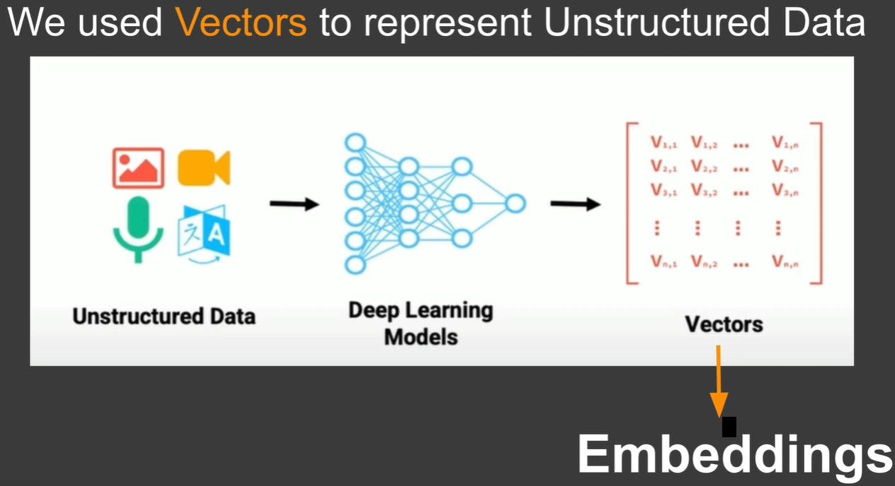
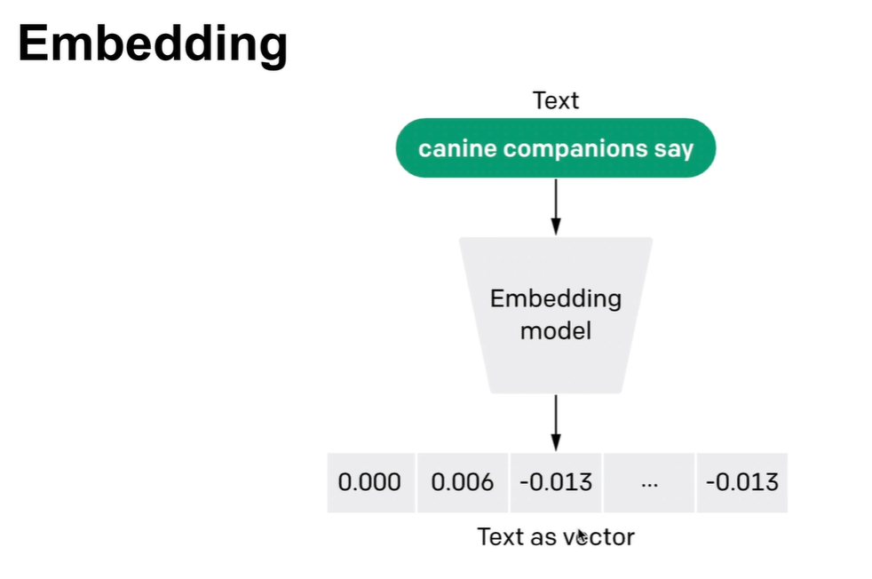

# Chroma DB Notes

# Data
* Data comes in 3 different formats - `structured`, `semi-structured`, `Unstructured`
* Global data sphere (data sphere means total amount of new data created and stored on persisten storage all around the world) by 2028 is 400 zeta bytes (zetabyte = 10^21 byte). Out of which 80% data is unstructured data. This data has no fixed size or format
* Question is - how we analyze if data has no fixed size or format?
	* Answer is - Using `Machine Learning` (or specifically `deep learning`)
* Example of unstructured data
	* Sensor data (temprator, gps etc)
	* Machine logs (system logs etc)
	* Internet of Things (IOT)
	* Computer vision
	* Emails
	* Text messages
	* Social media posts
	* Audit/Video recordings

# Vectors and Embeddings
* Unstructured data is increasing day by day
* We need mechanism to `Indexing`, `Search`? - This is where we need database for AI. This is the database AI model access Unstructured data. This is called `Vector Database`
* Vector database - special type of database. Solution for storing. Provides `Indexing`, `Search` across massive dataset of unstructured data. This uses `power of embeddings` from `machine learning models`
* `Embeddings` is heart of vector database
* How do we represent Unstructured data
	* We use `Vectors` to represent Unstructured data\

* Input Text -> Embedding capable LLM -> Series of numbers. These numbers are called `Vectors`. Also called `Embeddings`
* All above Vectors stored in `Vector database`
* Again - What is Vector?
	* Numerical array
	* Varities of data like image, audio, video, text can be represented with Vector via embedding\

---
# ChromaDB
* AI native open source embedding database
* Built in capability of embeddings
