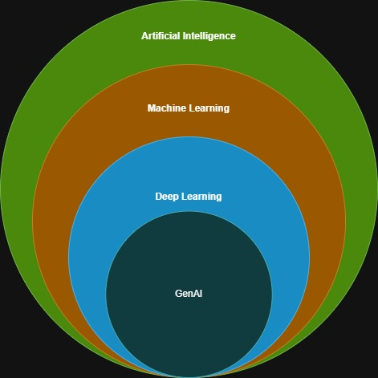

# AI ML Notes
---
* Word Artificial Intelligence first coined by John McCarthy in 1956

## Domains of AI
* Machine learning
* Deep learning / Neural networks
* Natural Language Processing (NLP)
* Knowledge base
* Robotics
* Expert systems
* Fuzzy Logic
* Application in Computer Vision and Image processing

---

**Stage of AI**

* Artificial Narrow Intelligence - ANI - Weak AI
* Artificial General Intelligence - AGI - Strong AI
* Artificial Super Intelligence

**Artificial Narrow Intelligence**
* Performs certain tasks
* Examples - Alexa, Siri, Self driving cars etc

**Artificial General Intelligence**
* Strong AI. Machines posses the ability to think and take decisions just like human beings
* Example: IBM Deep Blue Chess Game

**Artificial Super Intelligence**
* when capability of computers surpass human beings

---

**Types of AI**

* Reactive Machines AI - Operates solely based on present data. Take into consideration only current situation. Cannot form inferences from data to evaluate any future actions. Perform narrowed range of predefined tasks. Ex: IBM chess program that beat the world champion Garry Kasparov(1997). One of the impressive machine build so far

* Limited Memory AI - Can make informed and improved decision by studying past data from its memory. Has short-lived or temporary memory that can be used store past experiences and evaluate future actions. Ex: Self driving cars. Has limited memory that use data collected in the recent pasts to make immediate decisions. 

* Theory of Mind AI - more advanced type of AI. This category play important role in psychology. Mainly focus on emotional intelligence so that humans beliefs and thoughts can be better comprehended. Not fully developed yet but rigorous research is happening in this area

* Self Aware AI - Machines has own consciousness and self-aware. 

---

**Machine Learning**

* Making machines to interpret, process and analyze data to solve real world problems.
* Sub types - Supervised, Unsupervised, Reinforcement

---
**Deep learning / Neural networks**

* Process of implementing neural networks on high dimensional data to gain insights and form solutions
* Logic behind **-** face recognition algorithms (in facebook), Self driving cars, Virtual assistance like Alexa, Siri etc

---
# Machine Learning Types: Supervised, Unsupervised & Reinforcement Learning

## 1. Supervised Machine Learning

### Definition
Supervised Learning is a type of machine learning where the model is trained using **labeled data**.  
Each input data point has a corresponding **correct output (label)**.

> The model learns by comparing its predictions with known answers.

### How It Works
1. Provide input data with labels
2. Model makes predictions
3. Error is calculated
4. Model updates itself to reduce error

### Types
- **Classification** – Predicts a category
- **Regression** – Predicts a continuous value

### Examples
- Email spam detection (Spam / Not Spam)
- House price prediction
- Disease diagnosis

### Common Algorithms
- Linear Regression  
- Logistic Regression  
- Decision Trees  
- Random Forest  
- Support Vector Machines (SVM)  
- Neural Networks  

### Key Characteristics
- ✅ Requires labeled data
- ✅ High accuracy
- ❌ Labeling data is expensive

## 2. Unsupervised Machine Learning

### Definition
Unsupervised Learning works with **unlabeled data**.  
The system identifies **hidden patterns or structures** without any predefined output.

> The model learns by discovering relationships in the data.

### How It Works
1. Input data without labels
2. Analyze similarities and distributions
3. Identify patterns or groupings

### Main Tasks
- **Clustering**
- **Association rule mining**
- **Dimensionality reduction**

### Examples
- Customer segmentation
- Market basket analysis
- Image compression

### Common Algorithms
- K-Means Clustering  
- Hierarchical Clustering  
- DBSCAN  
- Apriori Algorithm  
- Principal Component Analysis (PCA)  

### Key Characteristics
- ✅ No labels required
- ✅ Useful for data exploration
- ❌ Results may be harder to interpret

## 3. Reinforcement Learning

### Definition
Reinforcement Learning (RL) is a learning method where an **agent** learns by interacting with an **environment**, receiving **rewards or penalties**.

> Learning occurs through trial and error.

### Key Components
- **Agent** – Learner
- **Environment** – World where agent operates
- **Action** – What the agent does
- **Reward** – Feedback
- **Policy** – Strategy to choose actions

### How It Works
1. Agent takes an action
2. Environment responds
3. Agent receives reward or penalty
4. Agent updates its policy

### Examples
- Game playing (Chess, Go)
- Robotics
- Traffic signal optimization
- Recommendation systems

### Common Algorithms
- Q-Learning  
- SARSA  
- Deep Q Networks (DQN)  
- Policy Gradient Methods  
- PPO (Proximal Policy Optimization)

### Key Characteristics
- ✅ Learns optimal decision-making
- ✅ No labeled data needed
- ❌ Computationally expensive

## 4. Comparison of Learning Types

| Feature              | Supervised Learning | Unsupervised Learning | Reinforcement Learning |
|---------------------|-------------------|----------------------|-----------------------|
| Data Type            | Labeled            | Unlabeled             | Reward-based          |
| Learning Style       | Learn from examples| Discover patterns     | Trial & Error         |
| Output               | Known predictions  | Hidden structures     | Optimal actions       |
| Human Supervision    | High               | Low                   | Indirect              |
| Typical Use Cases    | Prediction         | Exploration           | Strategy/Control      |

## 5. Comparison with Deep Learning

### What is Deep Learning?
Deep Learning is a **subset of Machine Learning** that uses **multi-layer artificial neural networks** to model complex patterns.

> Deep Learning can be **Supervised, Unsupervised, or Reinforcement-based**.

### Machine Learning vs Deep Learning

| Aspect | Machine Learning | Deep Learning |
|------|-----------------|--------------|
| Definition | Algorithms that learn from data | Neural networks with many layers |
| Feature Engineering | Manual | Automatic |
| Data Requirement | Works with small to medium data | Requires large datasets |
| Computational Power | Moderate | Very High (GPUs/TPUs) |
| Accuracy | Good | Excellent for complex tasks |
| Interpretability | Easier | Harder (Black-box) |

### Examples of Deep Learning Applications
- Image recognition
- Speech recognition
- Natural Language Processing (NLP)
- Autonomous vehicles
- Medical imaging

### Relationship Summary
- Machine Learning ⟶ Broad field
- Deep Learning ⟶ Specialized approach using neural networks
- Reinforcement Learning + Deep Learning ⟶ **Deep Reinforcement Learning**

## 6. When to Use What?

- ✅ **Supervised Learning**  
  When labeled data is available and prediction accuracy is required.

- ✅ **Unsupervised Learning**  
  When discovering patterns or insights in raw data.

- ✅ **Reinforcement Learning**  
  When decisions impact future outcomes.

- ✅ **Deep Learning**  
  When dealing with large datasets, images, audio, or language.

## 7. Final Takeaway
> **Deep Learning is not a replacement for Machine Learning — it is a powerful extension of it.**  
> Choose the approach based on **problem type, data availability, and resources**.

---
**Natural Language Processing (NLP)**

* Drawing insights from natural human language in order to communicate with machines and grow businesses
* Ex: Twitter - Uses NLP to filter terroristic language in tweets
* Ex: Amazon - Uses NLP to understand customer reviews and improve user experience

---

**Robotics**

* Focus on different branches and applications of robots
* AI robots are artificial agents which act in real world environment to produce results and taking some accountable actions.
* Ex: Sophia the Humanoid is very good example AI in robotics

---

**Fuzzy Logic**

* Computing approach that is based on principle of degree of truth instead of usual modern logic that we use which is basically the Boolean logic. Used in medical fields to solve complex problems which involve decision making. Also used in automating gear systems in cars

---

**Expert System**

* AI based computer system that learns and reciprocates decision making ability of human expert
* Uses if then logic notions to solve any complex problems
* Do not rely conventional procedural programming
* Used in information management, fraud detection, virus detection, managing medical and hospital records

---
## AI vs Machine Learning vs Deep Learning
* AI ML hierarchy from low to high
* GenAI -> Deep Learning (Neural Networks) -> Machine Learning (Supervied/NonSupervised/ReInforced) -> Artifical Intelligence\

---
## LLM - Large Language Model
* Model is an Algorithm with pre-trained dataset
* Generative AI (or) GenAI - Software which interacts using native language with LLMs which is pre-trained with existing datasets and can generate artifacts out of existing trained datasets based on it's neural network
* LLM has Foundational Model (which we train using datasets). It has modules for `text`, `image`, `audio`, `video processing` for individual use cases
* GPT - Generative Pre-training Transformer
---
## Common LLMs:
* Open AI - GPT
* Anthropic - Claude
* Google - Gemini(Ultra, Pro, Nano), PaLM 2
* Meta - Llama 2
* Cohere - Coral
* xAI - Grok

---
## Common GenAI:
* Github Copilot
* Microsoft Copilot
* OpenAI - ChatGPT
* Anthropic - Claude Code
---
## Prompt Engineering: How to talk to AI efficiently?
* fine tune models using prompts
* zero-shot, one-shot, few-shot learning
* Tokens - check chatGPT tokenizer
* BPE - Byte Pair Encoding
* Vectors
* Hallucinations - Like bluf - LLMs can bluf if they don't know answer

---
## RAG - Retrieval Augmented Generation - Scalable Architecture for LLMs
* Architecture using which we can have external datasources be used by LLMs. Also called as GG (Grounded Generation)
* Simple RAG - For example document reading
* Complex RAG - Like food delivery chatbot (get user details, get delivery partner details, his location, calculation distance between customer and delivery partner, tell approximate estimated time)
* LLM with Dynamic Data -> Need RAG Architecture

---
## SLM - Small Language Model
* Compact LLM with fewer parameters than larger models
* GenAI model designed for understanding and processing human language

### Some SLMs
* Ollama - ollama.com
* Google - Gemma
* Microsoft - Phi-3, Orca 2
* Mistral AI 70B
* Open AI - GPT-Neo, GPT-J
* BERT - mini, small, medium, tiny, MobileBERT, DistilBERT
* T5-small

---
## ollama - Open source SLM
* download and install. Refer [Ollama](../ollama/README.md)
* `ollama help` - shows list of commands to use
* `ollama list` - list downloaded models
* `ollama run [model-name]` - run specific model

---
# Huggingface
Refer - https://huggingface.co/

---
# Tools to work with AI
* TensorFlow
* ScikitLearn
* NumPy
* Theano
* Keras
* Natural Language Analysis with NLTK (Natural Language Tool Kit)