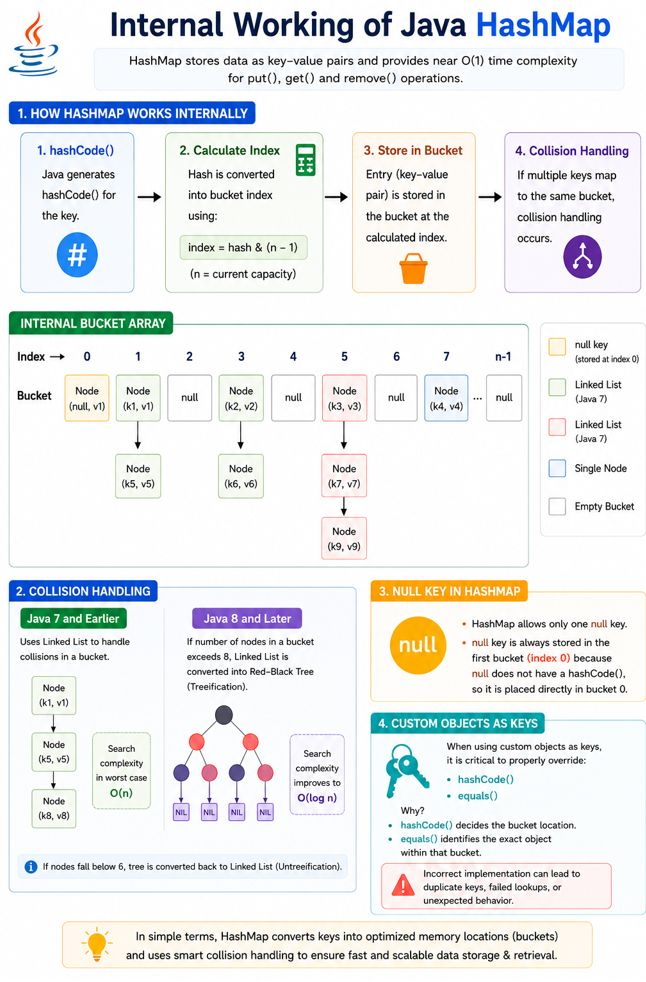

Internal Working of Java HashMap

HashMap stores data as key-value pairs and provides near O(1) performance 
for put() and get() operations using hashing.

⚙️ Internal Flow
 - hashCode() generates hash for the key
 - Hash determines the bucket index 
 - Entry is stored inside the bucket array
 - Collisions are handled using:
 - Linked List (Java 7)
 - Red-Black Tree (Java 8+)

📌 Null Key Handling
 - HashMap allows only one null key.
 - The null key is always stored in bucket index 0 since null does not have a hashCode().

⚠️ Custom Objects as Keys
 ✅Properly overriding both:
 - hashCode()
 - equals()
 ✅is critical because:
 - hashCode() decides bucket location
 - equals() identifies the exact key within the bucket
 - Incorrect implementation can cause failed lookups or duplicate entries.

🚀 Key Facts
 ✅ Treeification improves worst-case search to O(log n)
 ✅ Default capacity = 16
 ✅ Load factor = 0.75
 ✅ Multiple null values allowed
 ✅ Not thread-safe

📌TL;DR
In simple terms, HashMap converts keys into optimized memory locations (buckets) for fast and scalable data retrieval.
